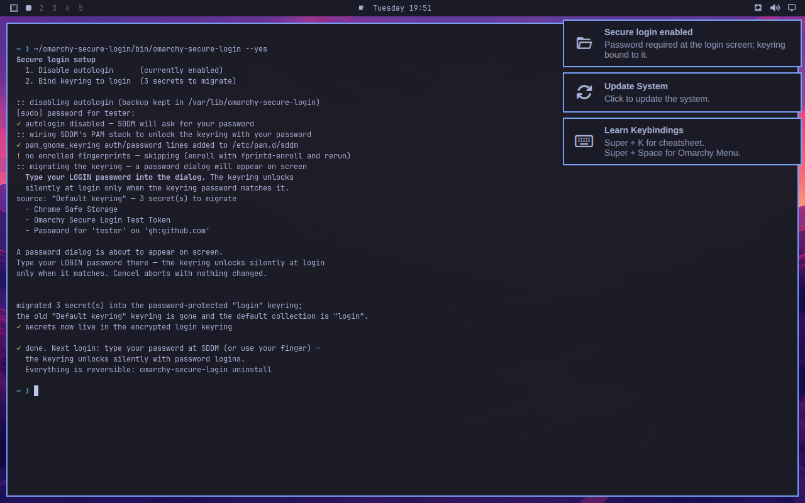
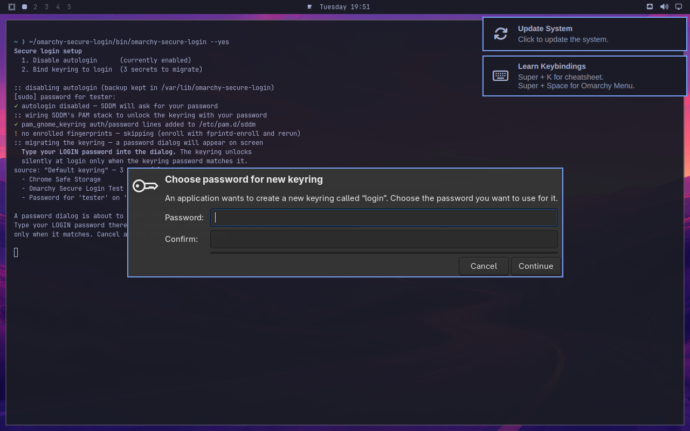
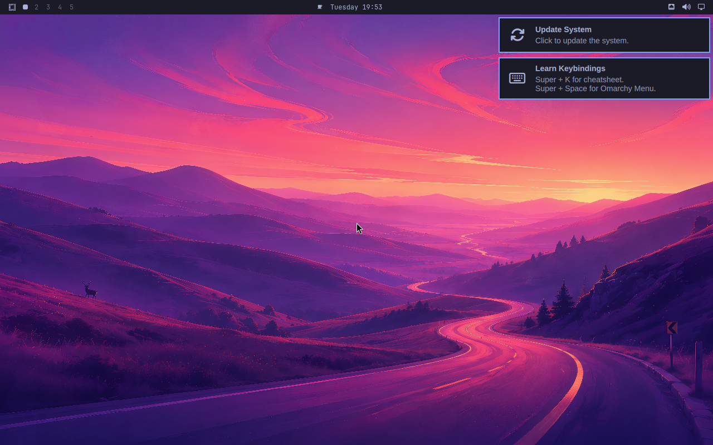
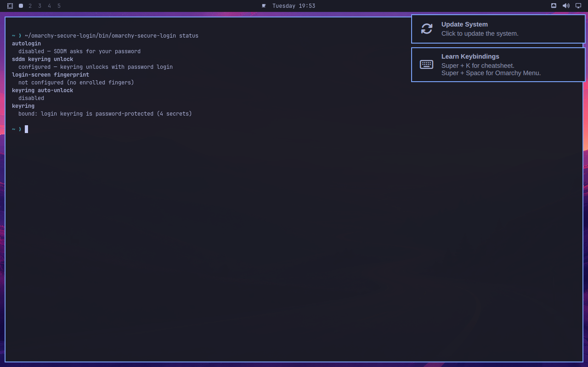

# omarchy-secure-login

Opt-in secure login for [Omarchy](https://omarchy.org): turn off autologin, bind the secret keyring to your login password, and use your fingerprint at the login screen if a reader is enrolled. Everything is reversible, and nothing changes until you run it.

## The new login experience

Every screenshot below is real: captured by the [QEMU validation run](#validation) on a disposable Omarchy VM using the stock Omarchy 4.0.4 ISO with the default theme — no mockups.

**Before:** an encrypted Omarchy install boots through the LUKS prompt and logs you straight into the desktop, forever, without asking anything.

**After:** the default Omarchy greeter waits for your password instead of autologging in —

<p align="center">
  
  <br><em>The stock Omarchy login screen — now it actually asks. <code>loginctl</code> proves no session
  was auto-created: the greeter holds the seat.</em>
</p>

Setup takes one command and one dialog. `omarchy-secure-login` walks the machine through each piece —

<p align="center">
  
  <br><em>The wizard in the default Omarchy terminal: autologin disabled, SDDM's PAM stack wired to
  unlock the keyring, secrets migrating out of the passwordless keyring.</em>
</p>

<p align="center">
  
  <br><em>The one dialog you type your login password into — it goes straight to the keyring daemon,
  never through the tool. Secrets are copied into the new encrypted keyring, verified, and only then
  is the old passwordless one deleted.</em>
</p>

After typing your password at the greeter, the desktop comes up exactly as before — but the keyring
already unlocked with that keystroke, silently, via PAM:

<p align="center">
  
  <br><em>Same desktop, same default theme — plus an encrypted keyring that unlocked with your login.</em>
</p>

Locking your session (menu → System → Lock, or your lock keybinding) looks the same as it
always did — your password unlocks it — the utility only changed what happens at login:

<p align="center">
  
  <br><em>The lock screen after setup — password prompt, unchanged; validated by unlocking with it.</em>
</p>

And `omarchy-secure-login status` always tells you where you stand:

<p align="center">
  
  <br><em>Every piece of the setup, reported.</em>
</p>

## Why

Omarchy's defaults trade a boundary for zero prompts: on encrypted installs SDDM autologins forever ("the LUKS prompt is the auth boundary"), and the shipped keyring has **no password at all** — secrets (gh credentials, browser keys, 2FA seeds) sit unencrypted in `~/.local/share/keyrings/` and any process running as your user can read them, forever, without ever knowing a secret.

This utility restores both boundaries for people who want them:

1. **No more autologin** — SDDM asks for your password (or finger) every login.
2. **Keyring bound to the login password** — secrets are encrypted at rest, the keyring unlocks silently the moment you type your password at SDDM, and it locks between sessions.
3. **Fingerprint at the login screen and lock screen** — when `fprintd` has enrolled fingers.

## The tradeoff to know before enabling fingerprint

The keyring can only be unlocked with a *password*. When you log in with your finger, no password is typed, so:

| Login method | Keyring |
| --- | --- |
| Password at SDDM | Unlocks silently with the login — zero prompts |
| Fingerprint at SDDM | Stays locked; one "Unlock Login Keyring" dialog at the first app that needs a secret — unless auto-unlock is enabled (below) |

The fingerprint prompt is inherent to how PAM and the keyring interact (stock GNOME behaves the same): a fingerprint produces a yes/no, never secret material, so nothing exists to decrypt the keyring with. Both paths are still better than the default: secrets are encrypted at rest either way.

### Optional: auto-unlock for fingerprint logins

For people who want fingerprint logins *and* a silent keyring, the utility offers an explicit opt-in:

```
omarchy-secure-login --keyring-auto-unlock
```

This stores the keyring password in a root-only file (`/var/lib/omarchy-secure-login/keyring-pass`, mode 600) and adds a `pam_exec` session hook to SDDM that feeds it to your keyring daemon through its own control protocol — the same wire format `pam_gnome_keyring` uses. A fingerprint login then arrives at an already-unlocked keyring, with no dialog.

Know exactly what this trades:

- **The file is a plaintext copy of your keyring password** — which on Omarchy is also your LUKS passphrase and your sudo password. Root-only, inside your encrypted disk, deleted by `uninstall`, but a real weakening compared to only hashes in `/etc/shadow`.
- The hook only fires for the SDDM graphical login (`PAM_SERVICE=sddm`), never for ssh, su, or cron sessions — a headless login cannot trigger the unlock.
- It is never enabled by default: `--yes` alone will not turn it on. The wizard asks, and the flag is the unattended consent.
- If the stored password ever stops matching (you changed your login password), the hook fails closed — the stock unlock prompt appears at first secret use, exactly as without the feature.

`uninstall` removes the PAM hook, the hook script, and deletes the stored password file. The keyring itself stays bound, as always.

## What changes, exactly

| Piece | Change |
| --- | --- |
| `/etc/sddm.conf.d/autologin.conf` | Backed up to `/var/lib/omarchy-secure-login/`, then removed |
| `/etc/pam.d/sddm` | The `pam_gnome_keyring` `auth`/`password` lines Omarchy's installer strips are restored (silent keyring unlock, automatic re-key on password change); with an enrolled reader, `auth sufficient pam_fprintd.so` is added ahead of them |
| Lock screen | `omarchy-apply-lock` is re-run so the lock screen gets its fingerprint PAM service |
| `~/.local/share/keyrings/` | A password-protected keyring named `login` is created (you type your login password into the standard gcr dialog — it never passes through this tool), every secret is copied out of the passwordless keyring, the default alias is repointed, and the old keyring is deleted **only after the copy is verified** |

`uninstall` restores autologin and the stock PAM stack. The keyring intentionally stays bound — secrets don't get un-encrypted by a downgrade of policy; see the README section on reverting manually.

## Install

```bash
git clone https://github.com/basecamp/omarchy-secure-login
cd omarchy-secure-login
./install.sh          # copies to /usr/local/bin
omarchy-secure-login  # interactive wizard
```

Or run straight from a checkout. `omarchy-secure-login status` reports every piece's current state without changing anything.

## Validation

Every change this tool makes is validated on a disposable QEMU VM before release, with the default Omarchy theme, using the harness in the Omarchy repo (`test/vm`):

```bash
cd ../omarchy && ./test/vm install lab   # once: golden encrypted Omarchy base
cd ../omarchy-secure-login && ./test/validate.sh
```

`validate.sh` boots a fresh VM from the base, seeds test secrets, runs the utility end-to-end (typing the VM's password into the real gcr dialog over QMP), verifies every file it touched, reboots to capture the changed login experience, logs in at the SDDM greeter, and proves the keyring unlocked silently with that password. The screenshots embedded above are exactly the files that run captures:

- `screenshots/01-setup-terminal.png` — the wizard's summary after a successful run
- `screenshots/02-keyring-password-dialog.png` — the one dialog you type your login password into
- `screenshots/03-sddm-login.png` — the changed boot experience: the default Omarchy greeter asking for a password instead of autologging in
- `screenshots/04-desktop-after-login.png` — the desktop after password login, keyring already unlocked
- `screenshots/05-status.png` — `omarchy-secure-login status`
- `screenshots/06-lock-screen.png` — the lock screen after setup, unlocked with the login password during the run

It finishes by running `uninstall` and verifying the restoration. Limitations that cannot be exercised in QEMU: real fingerprint readers (the config path is validated by stubbing enrollment; hardware behavior is on the reader), and Bluetooth-class attacks (unrelated to this tool).

## Manual revert of the keyring

If you ever want Omarchy's passwordless keyring back: export your secrets first (an app like Seahorse can show them), then `rm ~/.local/share/keyrings/login.keyring` — but be deliberate: this drops every stored secret. Chromium regenerates its own storage key; `gh auth login` re-creates its credentials.

## Relationship to Omarchy

The passwordless keyring is Omarchy's deliberate default — its install scripts are written to defend it — and nothing suggests upstream intends to change that. This utility is purely opt-in for people who prefer the boundary. Design notes for what a native implementation could look like live in `plans/keyring-security.md` in our fork of the Omarchy repo; that is our proposal, not an Omarchy roadmap, though the migration code here is structured so the useful pieces could be offered upstream.